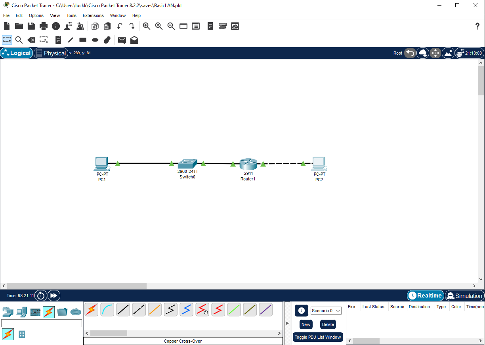

# Basic LAN Lab – CCNA Beginner Project

## 📌 Overview
This lab simulates a small LAN with two PCs connected through a switch and router.  
It demonstrates IP addressing, default gateways, and basic connectivity testing.  

## 🖼️ Network Topology


- **LAN 1 (192.168.1.0/24)** → PC1  
- **LAN 2 (192.168.2.0/24)** → PC2  
- **Router** → Connects both LANs  

## 💻 IP Addressing Scheme
| Device        | Interface     | IP Address     | Subnet Mask     | Default Gateway |
|---------------|--------------|----------------|-----------------|-----------------|
| PC1           | NIC          | 192.168.1.10   | 255.255.255.0   | 192.168.1.1     |
| Router        | Gb0/0        | 192.168.1.1    | 255.255.255.0   | -               |
| Router        | Gb0/1        | 192.168.2.1    | 255.255.255.0   | -               |
| PC2           | NIC          | 192.168.2.10   | 255.255.255.0   | 192.168.2.1     |

## ⚙️ Router Configuration
```bash
Router> enable
Router# configure terminal
Router(config)# interface GigabitEthernet0/0
Router(config-if)# ip address 192.168.1.1 255.255.255.0
Router(config-if)# no shutdown
Router(config)# interface GigabitEthernet0/1
Router(config-if)# ip address 192.168.2.1 255.255.255.0
Router(config-if)# no shutdown
Router(config)# end
Router# write memory
```

## 🧪 Tests Performed

✅ PC1 → ping Router (192.168.1.1) → Success

✅ PC1 → ping PC2 (192.168.2.10) → Success

✅ PC2 → tracert PC1 → Shows 1 hop (router) → Success

## 📚 Takeaways

- Proper IP addressing and gateways are required for inter-subnet communication.

- Routers enable communication between different LANs.

- Documenting configurations helps in troubleshooting and knowledge sharing.

## 🔧 Skills Demonstrated

Cisco IOS command-line configuration

Subnetting & gateway setup

Router interface activation (no shutdown)

End-to-end connectivity testing (ping, tracert)

Documentation & troubleshooting